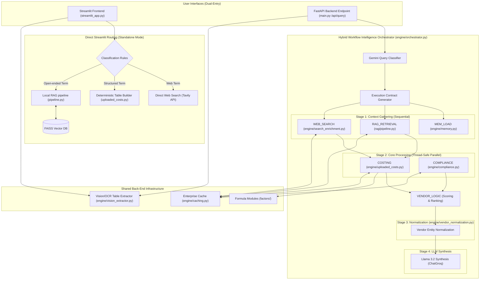
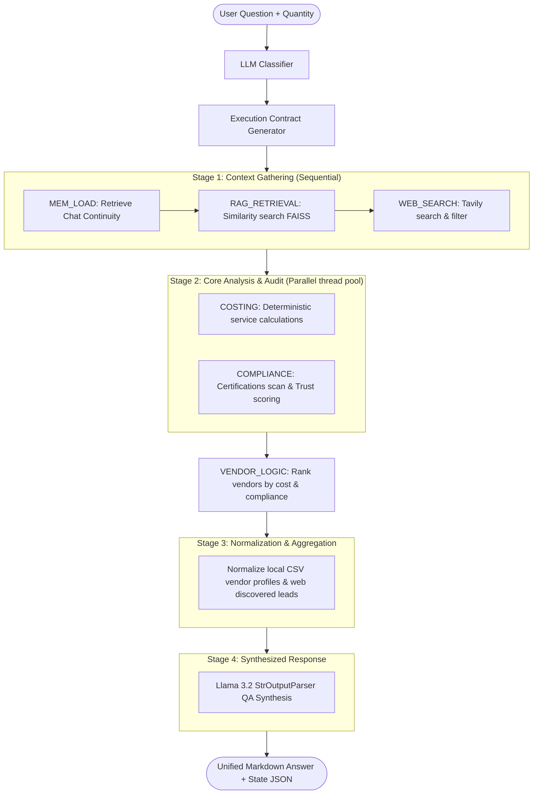
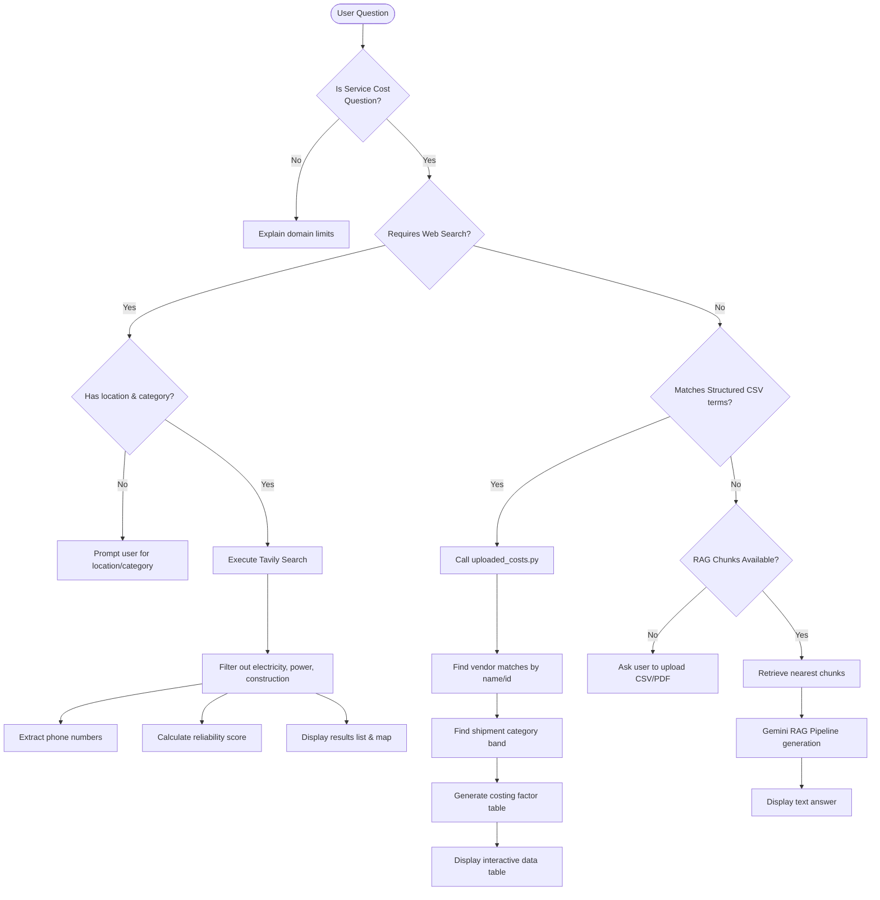
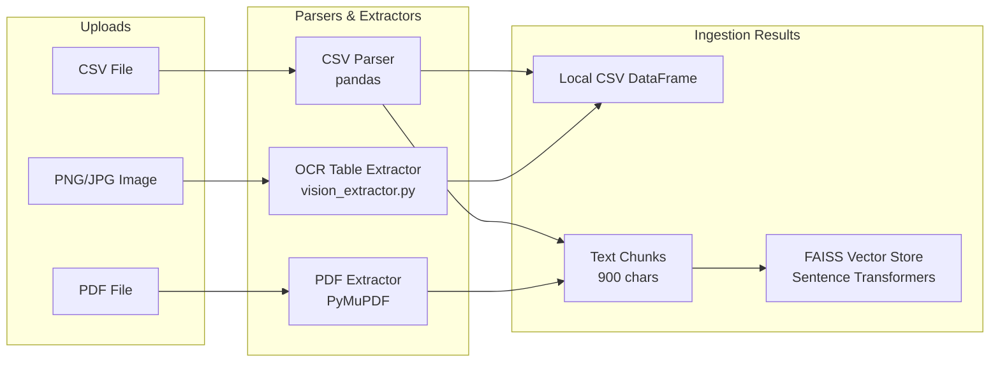

# Service Costing RAG Application Workflow Blueprint

This document outlines the complete architectural workflows, data processing sequences, and deterministic costing logic used in the **Service Costing RAG** application. 

It covers both entry points:
1. **Standalone Streamlit Routing (Legacy Standalone Mode)**
2. **API-Driven Hybrid Workflow Intelligence Orchestrator (FastAPI + Staged Pipeline)**

---

## 1. Unified Multi-Entry Architecture Overview

The system operates under a dual-entry structure. Users can interact via a standalone desktop interface or via an enterprise REST API.



---

## 2. The Staged Hybrid Workflow Orchestration (FastAPI Pathway)

When queried via the FastAPI server, the request runs through a **4-stage sequential and parallel execution pipeline** managed by `engine/orchestrator.py`:



### Breakdown of the 4 Stages

#### Stage 1: Context Gathering (Sequential)
- **MEM_LOAD** (`engine/memory.py`): Restores the conversation continuity rules.
- **RAG_RETRIEVAL** (`rag/pipeline.py`): Executes similarity searches on vector embeddings of uploaded PDFs/CSVs.
- **WEB_SEARCH** (`engine/search_enrichment.py`): Performs Tavily web searches to discover new vendors or benchmarks.

#### Stage 2: Core Analysis & Auditing (Concurrent Thread Pool)
Runs parallel workloads via `ThreadPoolExecutor` to minimize processing latency:
* **COSTING** (`engine/uploaded_costs.py`): Calculates the total service cost using shipment quantity and selected costing factors.
* **COMPLIANCE** (`engine/compliance.py`): Audits extracted texts and search hits using regex validation rules.

##### Compliance Trust Scoring Model
Trust scores range between $0.0$ and $1.0$ based on verified certifications:
* **ISO 13485**: `0.35` (Medical Quality)
* **FDA Approved/Registered**: `0.30` (Federal Safety)
* **CE Mark**: `0.20` (European Compliance)
* **GMP**: `0.10` (Good Manufacturing)
* **ISO 9001**: `0.05` (General Quality)

##### Deterministic Cost Formula
$$\text{Total Cost} = \sum (\text{Packaging Rate} + \text{Sterilization Rate} + \text{Logistics Rate} + \text{Quality Rate} + \text{Warehousing Rate}) \times \text{Quantity}$$

* **VENDOR_LOGIC**: Executes immediately after costing is complete to rank vendors.

#### Stage 3: Normalization & Aggregation
Uses `engine/vendor_normalization.py` to organize structured data fields (costing breakdowns, contact details, verified certifications, risk flags, and lead times) for both CSV-based rate-card vendors and external web leads.

#### Stage 4: Synthesis & Output
Generates a structured report using Llama 3.2 via ChatGroq, providing tables, risk flags, and an objective recommendation.

---

## 3. Standalone Streamlit Query Flow (Fallback Routing)

If the Streamlit application is run locally without the API backend, it relies on pattern-matching routing rules:



---

## 4. Ingestion & Preprocessing Workflow

Processes raw uploads into vector index chunks and dataframes:



---

## 5. Shared Enterprise Caching Layer

To optimize performance and minimize external API expenses, all costing calculations, similarity checks, Tavily searches, and compliance audits utilize a thread-safe caching system in `engine/caching.py`:

```text
Function Parameters ---> Argument Serializer ---> MD5 Hash Generator ---> Cache Lookup (Get/Set)
```

- **Thread-Safety**: Governed by reentrant locks (`threading.Lock`).
- **Keys**: Arguments and sorted keyword parameters are serialized to produce standard MD5 hash identifiers.

---

## 6. Multi-Modal Ingestion & Processing Pipeline Validation Report

> [!IMPORTANT]
> This section contains the architectural analysis and validation results of the multi-modal document ingestion pipeline based on the actual codebase implementation.

### 6.1 Current Ingestion Architecture Analysis
The current ingestion flow handles files through a dual-entry paradigm (Streamlit standalone context vs FastAPI server-side cache). CSV files parse cleanly through Pandas, PDFs split page-by-page via PyMuPDF (`fitz`), and Image/OCR tasks are offloaded to Llama 3.2 Vision on Groq. The resulting chunks and structured tables are vectorized with HuggingFace embeddings and stored locally inside a FAISS vector index.

### 6.2 CSV Support Assessment
* **Status**: **Fully Implemented**
* **Validation Details**: CSV ingestion natively parses structured tables via pandas (`pd.read_csv`). Chunks are generated dynamically row-by-row inside `dataframe_to_chunks()` (located in `rag/pipeline.py`), keeping header-column mapping intact for accurate retrieval. The costing engine easily parses these categories.

### 6.3 PDF Support Assessment
* **Status**: **Partially Implemented**
* **Validation Details**: Digital PDFs split page-by-page and chunk correctly (900-char size, 120-char overlap).
* **🚨 Critical API Bug**: Scanned PDFs trigger the vision OCR parser (`extract_rate_card_from_media`). However, sending base64-encoded PDF files inside an `image_url` payload (`data:application/pdf;base64,...`) is unsupported by the Llama 3.2 Vision API on Groq. Because the exception is caught and swallowed silently inside a generic try-catch block, OCR for scanned PDFs fails silently, extracting zero rate cards and producing no RAG chunks.

### 6.4 Image/OCR Support Assessment
* **Status**: **Partially Implemented**
* **Validation Details**: PNG, JPG, and JPEG rate cards are base64-encoded and sent to `llama-3.2-90b-vision-preview` under a prompt requiring clean CSV formatting.
* **Weaknesses**: The pipeline lacks an offline OCR fallback (such as Tesseract or EasyOCR). If the Groq API key is missing or rate limits are reached, the vision OCR fails silently with no backup mechanism.

### 6.5 Chunking Pipeline Assessment
* **Status**: **Fully Implemented**
* **Validation Details**: Implements 900-character chunk sizes with 120-character overlap.
* **Evolved Cost Chunks**: A unique mechanism inside `build_costing_engine_chunks()` generates deterministic cost comparison rows *before* embedding generation and indexes them as RAG context. This makes calculated rates and vendor scores fully searchable.

### 6.6 Embedding Pipeline Assessment
* **Status**: **Fully Implemented**
* **Validation Details**: Employs LangChain's HuggingFace sentence transformer integration, loading the `BAAI/bge-small-en-v1.5` model. Model weight parameters are stored locally inside the `.model_cache` folder, bypassing the need for cloud-based embeddings.

### 6.7 FAISS Integration Assessment
* **Status**: **Fully Implemented**
* **Validation Details**: Utilizes LangChain community FAISS wrappers to load and search indexes local to disk.
* **Weakness**: Documents are stored with generic index tags (`metadata={"source": f"chunk_{i}"}`), losing real filenames and page numbers. This prevents native FAISS metadata filtering.

### 6.8 Structured Extraction Assessment
* **Status**: **Fully Implemented (CSV/Images) | Broken (PDFs)**
* **Validation Details**: Safely coerces extracted rates to structured column parameters (`packaging_rate`, `sterilization_rate`, `logistics_rate`, `quality_rate`, `warehousing_rate`) using `pd.to_numeric`. However, extraction is broken for scanned PDFs.

### 6.9 Missing Ingestion Capabilities
1. **Scanned PDF Layout OCR**: Missing tools to extract text/tables from scanned PDFs prior to chunking.
2. **Local OCR Engine Fallback**: Lack of local OCR library fallbacks (Tesseract/EasyOCR) for offline capabilities.
3. **Flexible Schema Matching**: Strict column headers are forced; the system cannot parse non-standard column naming conventions.

### 6.10 Weaknesses in Ingestion Pipeline
1. **Swallowed Exceptions**: Try-catch blocks in `vision_extractor.py` silently ignore API key failures, timeouts, and rate limits.
2. **Mime-type API Mismatch**: Encoding raw PDF bytes in an `image_url` payload causes vision API failures.
3. **FAISS Tag Loss**: Native document indices do not retain page or file metadata.

### 6.11 Enterprise Readiness Assessment
* **Status**: **Not Enterprise-Ready**
* **Key Risks**:
  * **Global Session State Contamination**: FastAPI uploads and dataframes are stored in shared in-memory lists (`GLOBAL_CSV_DATAFRAMES` and `GLOBAL_RAG_CHUNKS`). Under concurrent multi-user workloads, users' files will overwrite each other, leaking proprietary rates.
  * **Memory Scaling**: Storing all CSV dataframes globally in RAM poses memory depletion risks.

### 6.12 Recommended Improvements
1. **Scope Ingestion to Sessions**: Re-architect `main.py` and `streamlit_app.py` to bound uploads to unique user sessions or database indexes rather than sharing global lists.
2. **Convert PDF to Image**: Integrate a preprocessing script (such as `pdf2image`) to convert PDF pages to standard PNG images before sending them to the Groq Vision model.
3. **Structural Metadata Mapping**: Populate the `Document` metadata field with the original source filename and page coordinates to enable granular filtering.

### 6.13 Priority Ingestion Roadmap (Fixes)

```mermaid
gantt
    title Ingestion Pipeline Remediation Roadmap
    dateFormat  X
    axisFormat %d
    
    section Core Fixes
    P1: Fix Shared Global Variables (Security)        :active, p1, 0, 3
    P2: Fix Scanned PDF Vision OCR Mime-Type (Bug)      :active, p2, 1, 4
    
    section Optimization
    P3: Integrate Native FAISS Metadata Tags (Feature) : p3, 3, 6
    P4: Integrate Offline OCR Local Fallback (Feature)  : p4, 5, 8
```

* **Priority 1 (Critical)**: Refactor global storage variables in `main.py` to isolate files by session.
* **Priority 2 (Critical)**: Resolve the PDF-in-Image-URL API bug by rendering scanned PDF pages to PNG before vision calls.
* **Priority 3 (High)**: Map source filenames and page numbers to native FAISS metadata tags for targeted searches.