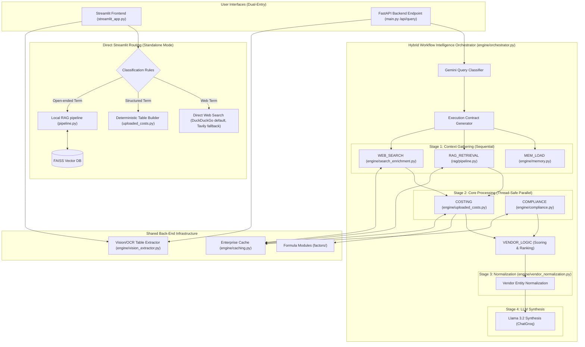
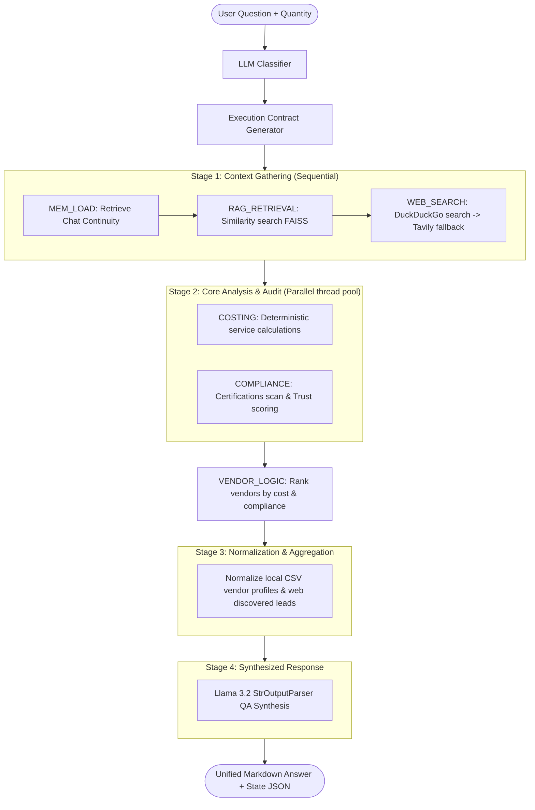
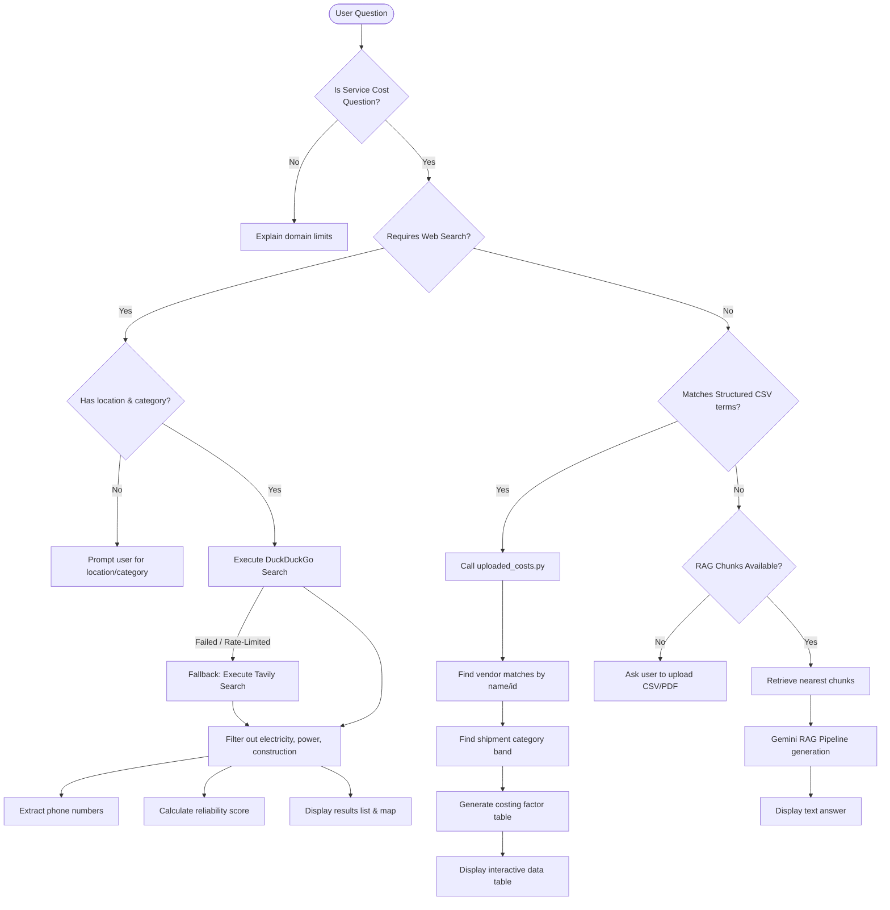
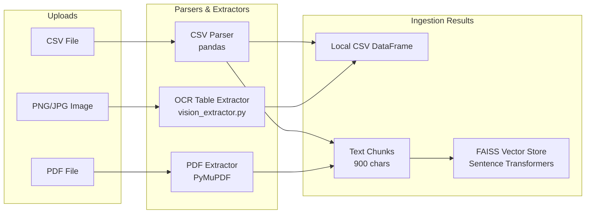

# Service Costing RAG Application Workflow Blueprint (Updated)

This document outlines the complete architectural workflows, data processing sequences, and search-enriched costing logic used in the **Service Costing RAG** application, fully updated for the new hybrid search pipeline (DuckDuckGo + Tavily).

It covers both entry points:
1. **Standalone Streamlit Routing (Legacy Standalone Mode)**
2. **API-Driven Hybrid Workflow Intelligence Orchestrator (FastAPI + Staged Pipeline)**

---

## 1. Unified Multi-Entry Architecture Overview

The system operates under a dual-entry structure. Users can interact via a standalone desktop interface or via an enterprise REST API.



---

## 2. The Staged Hybrid Workflow Orchestration (FastAPI Pathway)

When queried via the FastAPI server, the request runs through a **4-stage sequential and parallel execution pipeline** managed by `engine/orchestrator.py`:



### Breakdown of the 4 Stages

#### Stage 1: Context Gathering (Sequential)
- **MEM_LOAD** (`engine/memory.py`): Restores the conversation continuity rules.
- **RAG_RETRIEVAL** (`rag/pipeline.py`): Executes similarity searches on vector embeddings of uploaded PDFs/CSVs.
- **WEB_SEARCH** (`engine/search_enrichment.py`): Performs a hybrid search:
  * **Default (100% Free)**: Queries **DuckDuckGo Search** (using `duckduckgo-search` library). It targets verified vendor portals (`indiamart.com`, `tradeindia.com`, `alibaba.com`, etc.) without requiring any API keys.
  * **Fallback**: If DuckDuckGo gets rate-limited (empty results) or raises an exception, the pipeline instantly and silently falls back to **Tavily Search** (if `TAVILY_API_KEY` is configured).

#### Stage 2: Core Analysis & Auditing (Concurrent Thread Pool)
Runs parallel workloads via `ThreadPoolExecutor` to minimize processing latency:
* **COSTING** (`engine/uploaded_costs.py`): Calculates the total service cost using shipment quantity and selected costing factors.
* **COMPLIANCE** (`engine/compliance.py`): Audits extracted texts and search hits using regex validation rules.

##### Compliance Trust Scoring Model
Trust scores range between $0.0$ and $1.0$ based on verified certifications:
* **ISO 13485**: `0.35` (Medical Quality)
* **FDA Approved/Registered**: `0.30` (Federal Safety)
* **CE Mark**: `0.20` (European Compliance)
* **GMP**: `0.10` (Good Manufacturing)
* **ISO 9001**: `0.05` (General Quality)

##### Deterministic Cost Formula
$$\text{Total Cost} = \sum (\text{Packaging Rate} + \text{Sterilization Rate} + \text{Logistics Rate} + \text{Quality Rate} + \text{Warehousing Rate}) \times \text{Quantity}$$

* **VENDOR_LOGIC**: Executes immediately after costing is complete to rank vendors.

#### Stage 3: Normalization & Aggregation
Uses `engine/vendor_normalization.py` to organize structured data fields (costing breakdowns, contact details, verified certifications, risk flags, and lead times) for both CSV-based rate-card vendors and external web leads.

#### Stage 4: Synthesis & Output
Generates a structured report using Llama 3.2 via ChatGroq, providing tables, risk flags, and an objective recommendation.

---

## 3. Standalone Streamlit Query Flow (Fallback Routing)

If the Streamlit application is run locally without the API backend, it relies on pattern-matching routing rules:



---

## 4. Ingestion & Preprocessing Workflow

Processes raw uploads into vector index chunks and dataframes:



---

## 5. Shared Enterprise Caching Layer

To optimize performance and minimize external API expenses, all costing calculations, similarity checks, web searches, and compliance audits utilize a thread-safe caching system in `engine/caching.py`:

```text
Function Parameters ---> Argument Serializer ---> MD5 Hash Generator ---> Cache Lookup (Get/Set)
```

- **Thread-Safety**: Governed by reentrant locks (`threading.Lock`).
- **Keys**: Arguments and sorted keyword parameters are serialized to produce standard MD5 hash identifiers.
